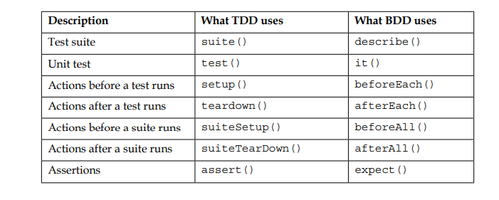

# Test Driven Design

> Rules

- Don’t write a line of new code unless you first have a failing automated test.
- Eliminate duplication

Technical implications:

- You must design organically, with running code providing feedback between decisions
- You must write your own tests
- Your development environment must provide rapid response to small changes
- Your designs must consist of many highly cohesive, loosely coupled components

## Cohesion

- Relationship inside module
- Connection betweeen functions
- Evaluate the quality that component/module focus on single responsibility

Cohesion types:

- Coincidential ( bad ) : eg Utility
- Logical ( good )
- Temporal (time) : a function invoked and has been catch an exception -> create error log and notify to user
- Procedural cohesion: a sequence operations. Eg: check permission -> open file
- COMMUNICATIONAL/INFORMATIONAL: work with the same record.
- SEQUENTIAL COHESION: output of A is input of B. A,B can be grouped in a module.
- FUNCTIONAL COHESION (GOOD)

## Coupling

- Relation between modules
- Dependencies between modules
- Evaluate the connection level between modules

## Target is creating and expandable and easy maintenance system

> low coupling, high cohesion và encapsulation

Finally, the TDD's mantra

> Red/Green/Refactor

- Red: write a little test that doesn't work, perhaps doesn't even compile at first
- Green: make the test work quickly, committing whatever sins necessary in the process
- Refactor: eliminate all the duplication created in just getting the test to work

An important criteria in software development

> Defect Density is the number of defects found within a software's lines of code

Defect Density = Defect count/size of the release

Eg:
Module A - 1000 LOC - 20bugs
Module B - 5000 LOC - 30bugs
Module C - 10,000 LOC - 50 bugs

Defect Density = 16,000 / 100 = 160

## Get back to TDD

· Start simply
· Write automated tests
· Refactor to add design decisions one at a time

## The rhythm of test-driven development

1. Quickly add a test
2. Run all tests and see the new one fail
3. Make a little change
4. Run all tests and see them all succeed
5. Refactor to remove duplication

Let's start with an example.

> Response the total days at a specific time when user provide month and year

What behavior will we need to produce the properly result?
What is the set of tests which, when passed, will demonstrate the presence of code we are confident will compute the result correctly?

Brainstorm:

- How do we react to invalid input? Throw an error
- Okie so, we have to validate input: month & year must be a number and month is in range [1,12], year is in range [0,9999]
- We need to be able to check is the input year is leap year
- We need to be able to response the approriate days of a month in a normal year.
- We need to be able to response the approriate days of February in a leap year ( 29 days )

Todo:

- if (!isInteger(year) || !isInteger(month) || month<1 || month > 12 || year < 0 || year >9999 then throw Error("Invalid month or year")
- eg: 2000 => leapyear
- eg: January - month==1 => days = 31
- eg Feb/2000 - month==2 && year==2000 => days = 29

We’ll make a to-do list to remind us what all we need to do, keep us focused, and tell
us when we are finished.

### When you begin writing tests, you will discover a common pattern

1. Create some objects ( fixture ) : expensive
2. Stimulate them
3. Check the results

Two constraints come into conflict:

- Performance—we would like our tests to run as quickly as possible
- Isolation—we would the success or failure of one test to be irrelevant to other tests

The "fixture" is expensive, we would like to create them once and then run lots of tests. But sharing objects between tests creates the possibility of test coupling.

### Our concerns

1. Setup
2. Counting: numbers of tests, errors
3. Teardown: cleanup
4. TestSuite: compose tests and run together - able to treat single tests and groups of tests exactly the same from a programmatic perspective
5.

## Patterns

### Test n.

1. How do you test your software?

- Write an automated test.

2. What happens when the stress level rises?

> Figure 1 has Stress negatively connected to Testing negatively connected to Errors positively connected to Stress

> Figure 2 has Stress positively connected to Automated Testing negatively connected to
> Errors and Stress, and Errors positively connected to Stress

However, with the automated tests you have a chance to choose your level of fear.

### Isolated Test

- First, make the tests so fast to run that I can run them myself, and run them often.
- Tests should be able to ignore each other completely: If I had one test broken, I wanted one problem. If I had two tests broken, I wanted two problems.
- Isolating tests encourages you to compose solutions out of many highly cohesive, loosely coupled objects.

### Test List

- First, put on the list examples of every operation that you know you need to implement.
- Next, for those operations that don’t already exist, put the null version of that operation.
- Finally, list all the refactorings that you think you will have to do to have clean code at the end of this session.

### Test-First

1. When should you write your tests?

- Before you write the code that is to be tested.

2. You won’t test after

- Your goal as a programmer is running functionality.

### Assert First

- When you are writing a test, you are solving several problems at once, even if you no longer have to think about the implementation

> The Bottom Up Approach:

· Where should you start building a system? With the stories that you will be
able to tell about the system when it is done.
· Where should you start writing a bit of functionality? With the tests that will
run when it is done.
· Where should you start writing a test? With the asserts that will pass when it is
done.

### Test Data

1. What data do you use for test-first tests?

- Use data that makes the tests easy to read and follow.

> You are writing tests for a reader, not just the computer

2. Data should be

- Meaningful data
- Don’t have a list of 10 items as the input data is a list of 3 items will lead you to the same design and implementation decisions.

The alternative to Test Data is Realistic Data, where you use data from the real world.
Realistic Data is useful when:

- You are testing real-time systems using traces of external events gathered from
  the actual execution
- You are matching the output of the current system with the output of a
  previous system (Parallel Testing)
- You are refactoring a simulation and expect precisely the same answers when
  you are finished, particularly if floating point accuracy may be a problem

### Evident Data

1. How do you represent the intent of the data?

- Include expected and actual results in the test itself, and try to make their relationship apparent

## Implementation Strategies

### Fake It (‘Til You Make It)

1. What is your first implementation once you have a broken test?

- Return a constant.

Once you have the test running, gradually transform the constant into an expression using variables

### Triangulation

This is a technique to analyze results of the same study using different methods of data collection. It is used for three main purposes: to enhance validity, to create a more in-depth picture of a research problem, and to interrogate different ways of understanding a research problem.

```java
public void testSum() {
    assertEquals(4, plus(2, 2));
    assertEquals(7, plus(3,4));
}
```

## Testing Concepts

### Unit Testing

- Unit testing is a testable piece of software.
- In other words, it is a function or method, which invokes a unit of module in software and check assumptions about the system that the developer has in mind.
- It can have more than one input and normally a single output. Sometimes, we treat a module of a system as a unit.
- A unit test is applicable to test a logical piece of code. Eg: getting and setting values in text field will not be considered in logical code.

Your concerns before writing the initial unit test:

1. Use a test framework or write your own
2. Automated build process
3. Collecting, displaying and tracking unit test coverage

Testing frameworks provide a lot of the ready-made piece of code, includes:

1. Test suite/case aggregation
2. Assertions
3. Mock/Stub helpers
4. Asynchronous testing implementation
5. And more ...

### Assertions

1. Equity assertions
2. Sameness assertions
3. Datatype assertions
4. Special value assertions
5. Forced failures

```js
class Example {
  constructor(private title: string) {
    this.title = title;
  }
}
// Ref : https://stackoverflow.com/questions/62564800/how-to-assert-data-type-with-jest
describe('Assertions', () => {
  beforeAll(() => {});
  // Equity assertions: 1 == '1'
  describe('Sameness assertions', () => {
    const objectA = { a: 1, b: { c: 2 } };
    const objectB = { a: 1, b: { c: 2.0 } };

    beforeAll(() => {});
    it('a should equal b', () => {
      expect(objectA).toEqual(objectB);
    });
    it('a should equal b', () => {
      expect(objectA).toStrictEqual(objectB);
    });
  });
  describe('Datatype assertions', () => {
    it('should be a number', () => {
      const a = 1;
      expect(typeof a).toBe('number');
    });
    it('should be an instance of Example', () => {
      const example = new Example('Example');
      expect(example).toBeInstanceOf(Example);
    });
  });
  describe('Special value assertions', () => {
    it('false should be false', () => {
      const a = false;
      expect(a).toBeFalsy();
    });
    it('null should be false', () => {
      const b = null;
      expect(b).toBeFalsy();
    });
    it('undefined should be false', () => {
      const c = undefined;
      expect(c).toBeFalsy();
    });
  });
});

```

### Benefit of Unit Testing

1. Quickly making big changes
2. Boost your confident
3. Helps to understand system design
4. Green lightning development
5. Faster development
6. Easy debugging
7. Reusable code
8. Saving cost

### Pitfalls of unit testing

1. Wrong assumptions for unit testing: it is not a tool, it is a methodology/technique.
2. Not suitable for a tight deadlines

### Unit Testing Frameworks

1. JestJS : support jsdom, BDD style
2. Jasmine: BDD style
3. Mocha(Testing Framework) & Chai(Assertion Libs):



## Glossary

1. Red
2. Green
3. Refactor
4. Fixture
5. Test suite
6. Test case
7. Assertion
8. Mock
9. Stub
10. Asynchronous
11. setUp
12. tearDown
13. Test double
14. Fake
15. Dummy
16. Spy
17. Regular Tests

### Mock

Mocks are lines of code with some hardcoded behavior and some expectations that
we have achieved from the requirement understanding phase. A mock will fail test,
if it is not defined as per expectation.

```ts
describe('Mock example', () => {
  describe('Mock a method of class', () => {
    const exampleGoMock = jest
      .spyOn(Example.prototype, 'go')
      .mockImplementation(() => {
        // become stub
        return 1;
      });
    it('test go function', () => {
      const example = new Example('test');
      example.go();

      expect(exampleGoMock).toBeCalledTimes(1);
      expect(exampleGoMock.mock.results[0].value).toEqual(1);
    });
  });
});
```

### Stubs

Similar to mocks, stubs are normally used to replace actual implementation of
any code. Stubs can be used to execute our implementation in one particular way.
We can see how custom code responds for different inputs.

> Mocks are used to verify the behavior of our code. Stubs are used to provide data that our code needs to run

## References

- https://www.educative.io/answers/what-is-faking-vs-mocking-vs-stubbing
- https://martinfowler.com/articles/mocksArentStubs.html
- https://www.toolsqa.com/blogs/differences-between-stubbing-and-mocking/
